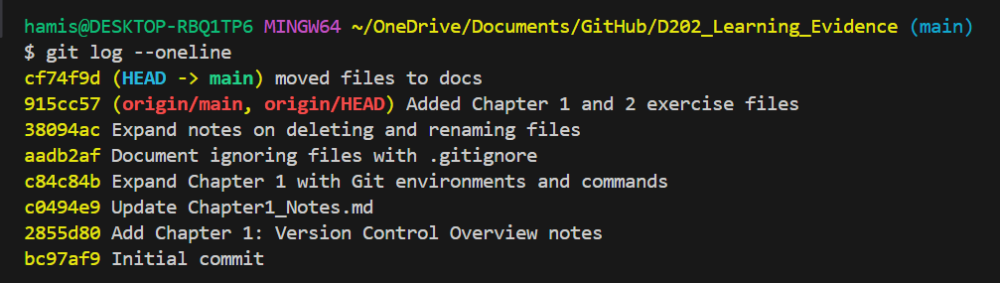

# Chapter 1: Version Control Overview

## What is Git?
* **Version Control System:** Git acts like a "historian with a time machine" for code.
* **History Tracking:** It tracks changes to files over time, allowing you to jump back and forth between versions.
* **Commits:** These are "save points" or checkpoints with messages describing what happened.
* **Branching:** Allows creating alternate realities/versions of the project to work on features without affecting the main original.
* **Merging:** The process of synchronizing branches back together.

## Tools Required
* **Git:** The core tool (download from git-scm.com).
* **Terminal:** Required to run commands (Git Bash on Windows, Terminal on Mac).
* **Node.js:** Often required for handling web project tools.
* **VS Code:** Recommended text editor.

## Setting up Git
* **Configuration:** Before starting, configure your identity so changes are credited to you.
    * Command: `git config --global user.name "Your Name"`
    * Command: `git config --global user.email "you@example.com"`
* **Initializing:** `git init` transforms a current folder into a Git repository.
    * This creates a hidden `.git` folder where Git stores all tracking data.
* **Staging:** The "waiting area" for files before they are committed.
    * Command: `git add .` (adds all files in the directory to staging).
* **Committing:** Saves the snapshot of the staged files to history.
    * Command: `git commit -m "Message"`
* **Checking History:** `git log` shows a list of all past commits.
## Understanding Git Environments
* **Commit Structure:**
    * **Hash:** A unique ID for every commit.
    * **HEAD:** A pointer to the current branch (reality) you are working on.
* **The Three Environments:**
    1.  **Working Environment:** The files as they currently look on your computer.
    2.  **Staging (The Queue):** A temporary area where you "queue up" changes before committing (`git add`). It's like "dating before marriage."
    3.  **Commit:** The final snapshot saved to history with a unique hash.
* **File States:**
    * **Tracked:** Files that existed in the previous snapshot (can be *Unmodified*, *Modified*, or *Staged*).
    * **Untracked:** New files that Git hasn't seen yet.
* **Key Commands:**
    * `git status`: Shows which files are changed, staged, or untracked.
    * `git restore <file>`: Discards changes in the working directory (undoes your work).
    * `git restore --staged <file>`: Removes a file from the staging area (keeps the changes but takes them out of the queue).
## Ignoring Files
* **Purpose:** Prevents Git from tracking sensitive files (API keys, passwords), operating system files (`.DS_Store`), or large dependencies (`node_modules`).
* **.gitignore File:** A text file created at the project root listing patterns to ignore.
    * **Syntax:**
        * `filename.ext` (ignores specific file)
        * `foldername/` (ignores entire folder, note the trailing slash)
        * `*.log` (ignores all files with this extension)
* **Important Rules:**
    * Git does **not** track empty folders.
    * If a file is *already* being tracked, adding it to `.gitignore` won't stop it. You must remove it from the cache first:
    * Command: `git rm -r --cached .` (Clears cache so .gitignore takes effect).
## Deleting and Renaming Files
* **Deleting Files:**
    * **Method 1 (Manual):** Deleting via file explorer/VS Code.
        * Git sees this as a "change" that must be staged manually.
    * **Method 2 (Git Command):** `git rm <filename>`
        * Deletes the file AND stages the deletion immediately.
        * **Undo:** Use `git restore --staged <file>` then `git restore <file>`.
* **Renaming/Moving Files:**
    * **Method 1 (Manual):** Renaming in file explorer.
        * Git sees this as two steps: Deleting the old file + Creating a new untracked file.
    * **Method 2 (Git Command):** `git mv <oldname> <newname>`
        * Renames and stages the change in one step.
        * `mv` stands for "move" (Linux command).
* **Key Takeaway:** Git always compares your current work to the **last commit**. If you rename a file back to its original name before committing, Git sees "no changes."
* ## Tracking Differences and History
* **Checking Changes:**
    * **Command:** `git diff`
    * Shows exactly what lines changed between your working file and the last commit.
    * **Key:** `+` (green) lines are added, `-` (red) lines are deleted.
    * **Tip:** Press `q` to exit if the diff is too long.
* **Checking History:**
    * **Command:** `git log` (shows full history).
    * **Command:** `git log --oneline` (shows a cleaner, shorter list of commits).
    
* **Comparing Commits:**
    * Command: `git diff <commit-hash>` (Compares current code to a specific point in the past).
* **Tools:**
    * **VS Code Source Control:** The sidebar in VS Code provides a visual way to stage changes.
## Changing History (Undoing Mistakes)
* **Amending Commits:**
    * Used to fix the very last commit (e.g., fixing a typo in the message).
    * Command: `git commit --amend`
* **Resetting (Time Travel):**
    * **Soft Reset:** Rewinds history but keeps your work safely in the folder.
    * **Hard Reset:** Rewinds history and *deletes* changes (Dangerous!).
    * Command: `git reset <commit-hash>`
* **Rebasing:**
    * A way to rewrite or clean up history (e.g., squashing commits together).
    * *Note: Can be tricky on Windows due to file locking!*